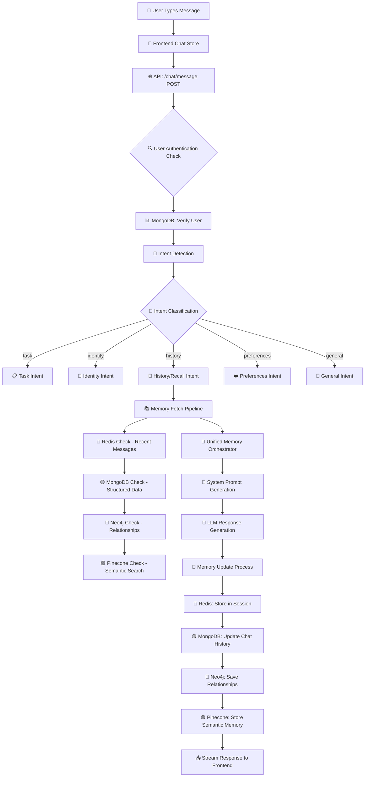

# 🌈 PRISM AI Studio - Complete Workflow Analysis

## 📊 **API Call Flow & Request Count**

### **Single User Message Journey**
```
USER INPUT → FRONTEND → BACKEND → RESPONSE
    1           1-3        5-8       1

Total API calls per message: 7-12 calls
```

### **Detailed API Call Breakdown**


---

## 🎯 **Intent Detection System**

### **Master Intent Detection Logic**
```python
# Located in: /app/services/main_brain.py lines 101-118

INTENT_PATTERNS = {
    "task": ["remind", "schedule", "task", "todo", "appointment", "calendar"],
    "identity": ["my name", "who am i"],
    "history": ["what did i say", "what did we talk", "what did we discuss", 
               "earlier", "previously", "recall", "remember when"],
    "preferences": ["things i like", "what do i like", "what are my interests"],
    "general": "everything else"
}
```

### **Intent Detection Examples**
| User Input | Detected Intent | Memory Systems Used |
|------------|----------------|-------------------|
| "My name is John" | `identity` | Neo4j (immediate write) |
| "What did we discuss yesterday?" | `history` | MongoDB → Redis → Neo4j |
| "Remind me to call mom" | `task` | MongoDB tasks collection |
| "What movies do I like?" | `preferences` | All systems (stop-on-hit) |
| "What's the weather?" | `general` | Recent Redis history only |

---

## 💾 **Memory System Architecture**

### **Memory Priority Order (Stop-on-Hit)**
```
1. 🔴 REDIS (Session Memory)     → 50-100ms
2. 🟡 MONGODB (Structured Data)  → 100-200ms  
3. 🔵 NEO4J (Graph Relations)    → 200-500ms
4. 🟢 PINECONE (Semantic Search) → 500-1000ms
```

### **Memory Access Patterns**
```
📥 MEMORY FETCH (per message):
├── Always: Redis recent history (10 messages)
├── Conditional: MongoDB user profile
├── Stop-on-Hit: First relevant memory source
└── Fallback: Empty memory context

💾 MEMORY STORAGE (after response):
├── Always: Redis session cache
├── Always: MongoDB chat history  
├── Conditional: Neo4j relationships (identity/facts)
└── Conditional: Pinecone vectors (semantic content)
```

---

## 🤖 **Response Generation System**

### **Master System Prompt Template**
```
📍 Location: /app/services/main_brain.py lines 345-450

🧠 PROMPT STRUCTURE:
├── 🌟 Core Identity (PRISM personality)
├── 🎭 Emotional Tone (detected from user input)
├── ⏰ Time Context (Asia/Kolkata timezone)
├── 💾 Memory Section (from unified orchestrator)
├── 🌍 Research Data (if web search triggered)
├── 📚 Conversation History (Redis/MongoDB)
├── 🎨 Style Guidelines (emojis, formatting)
├── 🔄 Interaction Rules (personalization)
└── ✅ Verification Instructions
```

### **Dynamic Prompt Components**
| Component | Source | When Used | Purpose |
|-----------|--------|-----------|---------|
| User Emotion | `detect_emotion()` function | Every message | Tone adaptation |
| Memory Context | Unified Memory Orchestrator | Based on intent | Personalization |
| Conversation History | Redis/MongoDB | Recall questions | Accurate responses |
| Research Data | Web scraping results | Complex queries | Real-time info |
| Time Context | IST timezone | Every message | Temporal awareness |

---

## 🔄 **Complete User Journey Flow**

### **Frontend → Backend Communication**
```
📱 FRONTEND (React/TypeScript)
├── 📝 User types in chat input
├── 🏪 ChatStore.sendMessage()
├── 🌐 api.ts: POST /chat/message
├── 📡 Streaming response handling  
└── 💬 Real-time UI updates

🖥️ BACKEND (FastAPI/Python)  
├── 🛡️ Authentication middleware
├── 🎯 Intent detection
├── 🧠 Memory pipeline
├── 🤖 LLM generation
├── 💾 Memory updates
└── 📤 Streaming response
```

### **Memory Update Workflow**
```
💾 AFTER EACH RESPONSE:
├── 🔴 Redis: add_message_to_history(user_id, user_msg, ai_response)
├── 🟡 MongoDB: Update session.messages[] array  
├── 🔵 Neo4j: Extract entities/relationships (conditional)
└── 🟢 Pinecone: Create embeddings (conditional)
```

---

## 📈 **Performance Metrics**

### **API Response Times**
```
⚡ Authentication Check: 10-50ms
🎯 Intent Detection: 5-20ms  
💾 Memory Fetch: 50-1000ms (stop-on-hit)
🤖 LLM Generation: 1000-3000ms
💾 Memory Storage: 100-500ms
📤 Response Streaming: Real-time
```

### **Database Load Distribution**
```
🔴 REDIS (High Frequency):
├── Every message: Recent history
├── Every response: Message storage
└── Session management

🟡 MONGODB (Medium Frequency):  
├── User authentication
├── Chat session management
├── User profile updates

🔵 NEO4J (Low Frequency):
├── Identity statements only
├── Relationship extraction
└── Knowledge graph queries

🟢 PINECONE (Lowest Frequency):
├── Semantic search fallback
├── Complex knowledge queries
└── Long-term memory storage
```

---

## 🎮 **Example User Scenarios**

### **Scenario 1: First Time User**
```
👤 User: "Hi, my name is Sarah and I love coffee"

🔄 Flow:
1. Intent: 'identity' (name detection)
2. Memory: Empty (new user)
3. Neo4j: IMMEDIATE write (core fact)
4. Response: Personalized greeting
5. Storage: Redis + MongoDB + Neo4j

💾 Stored:
├── Redis: Conversation pair  
├── MongoDB: User profile, chat session
├── Neo4j: "Sarah loves coffee"
└── Pinecone: Skip (not enough content)
```

### **Scenario 2: Recall Question**
```
👤 User: "What did we discuss about my job?"

🔄 Flow:
1. Intent: 'history' (recall pattern)
2. Memory: MongoDB session → Redis fallback  
3. Search: Stop-on-hit when job info found
4. Response: Exact conversation quotes
5. Storage: Only Redis (no new info)

🧠 Memory Sources Used:
├── ✅ MongoDB: Session messages
├── ✅ Redis: Recent history  
├── ⏭️ Neo4j: Skipped (found in MongoDB)
└── ⏭️ Pinecone: Skipped (stop-on-hit)
```

### **Scenario 3: General Question**
```
👤 User: "What's the best laptop for programming?"

🔄 Flow:
1. Intent: 'general' (no personal context needed)
2. Memory: Redis recent history only (fast)
3. Web Search: Triggered for current info
4. Response: Research-based with sources
5. Storage: Redis conversation only

🌍 External APIs:
├── Web scraping for laptop reviews
├── Price comparison sites
└── Tech specification sources
```

---

## 🔧 **Technical Configuration**

### **Environment Setup**
```bash
# Frontend (Port 5173)
VITE_API_URL=http://127.0.0.1:8000

# Backend (Port 8000)  
MONGODB_URL=mongodb://localhost:27017
REDIS_URL=redis://localhost:6379
NEO4J_URL=bolt://localhost:7687
PINECONE_API_KEY=your-key
```

### **Database Collections**
```
🟡 MONGODB:
├── users (user profiles)
├── sessions (chat histories)
├── tasks (user tasks/reminders)
├── mini_agents (specialized agents)
└── mood_history (emotional tracking)

🔵 NEO4J:
├── User nodes
├── Interest/Preference nodes  
├── Relationship edges
└── Entity connections

🟢 PINECONE:
├── Message embeddings
├── Knowledge vectors
├── Semantic search index  
└── Long-term memory vectors
```

---

## 🎯 **Key Symbols & Entities**

### **Memory Flow Symbols**
- 🔴 **Redis**: Fast session memory
- 🟡 **MongoDB**: Structured persistent data  
- 🔵 **Neo4j**: Relationship graphs
- 🟢 **Pinecone**: Semantic vectors
- 🧠 **Unified Orchestrator**: Memory coordination
- 🎯 **Intent Detector**: Message classification
- 🤖 **Main Brain**: Response generation
- 📡 **Streaming**: Real-time responses

### **API Entities**
- 👤 **User**: Authenticated user with sessions
- 💬 **Message**: User input with metadata
- 📝 **Session**: Chat conversation container
- 🤖 **Response**: AI-generated reply
- 📊 **Context**: Memory and environmental data
- 🌍 **Research**: Web-scraped real-time data

---

## ⚡ **Performance Optimizations**

### **Speed Improvements**
1. **Stop-on-Hit Memory**: Search stops when relevant memory found
2. **Redis First**: Always check fastest source first  
3. **Streaming Responses**: Start sending before completion
4. **Session Caching**: Keep recent conversations in memory
5. **Conditional Writes**: Only update memory when needed

### **Memory Efficiency** 
1. **Conversation Limits**: Max 20 messages per memory fetch
2. **Embedding Batching**: Group similar content for Pinecone
3. **Neo4j Filtering**: Only core facts stored in graph
4. **Redis Expiration**: Auto-cleanup old session data

---

## 🚀 **Development Commands**

```bash
# Frontend Development (Port 5173)
cd Frontend
npm run dev

# Backend Development (Port 8000)  
cd prism-backend  
python start_server.py

# Database Services
redis-server
mongod
neo4j console
```

This system processes **7-12 API calls per user message**, uses **4 different memory systems** with **stop-on-hit optimization**, and provides **real-time streaming responses** with **comprehensive memory integration**! 🌈✨